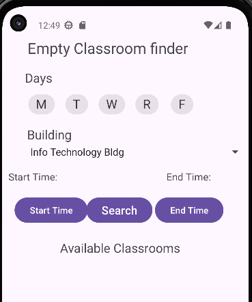
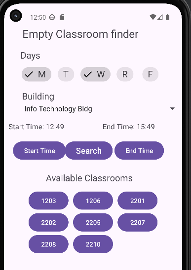

# Empty Classroom finder app

## Project Description
While in university, I enjoyed working in empty classrooms on campus. However, during the week, I often had to check multiple rooms to find one available. To solve this problem, I developed an Android app that lets users select a campus building and a time frame to quickly see which classrooms are empty.

## Screenshots

### Main Page

### Page after searching for open classrooms

